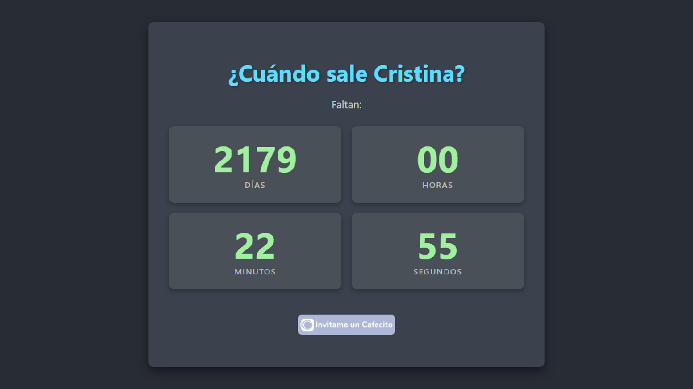

# ¿Cuándo sale Cristina? | Cuenta Regresiva



Un sencillo pero elegante sitio web que muestra una cuenta regresiva para la fecha en que se cumple la condena de Cristina Fernández de Kirchner por la Causa Vialidad.

**Visita el sitio en vivo:** [cuandosale.cristina.com.ar](https://cuandosale.cristina.com/)

---

## ✨ Características

- **Cuenta Regresiva en Tiempo Real:** Muestra los días, horas, minutos y segundos restantes.
- **Diseño Moderno y Responsivo:** Se ve genial en cualquier dispositivo, desde computadoras de escritorio hasta teléfonos móviles.
- **Mensaje Final:** Muestra un mensaje especial una vez que la cuenta regresiva llega a cero.
- **Botón de Cafecito:** Una forma fácil para que los visitantes te inviten un café.

---

## 🚀 Tecnologías Utilizadas

- HTML5
- CSS3 (con diseño responsivo)
- JavaScript (Vanilla JS)

---

## 🛠️ Instalación y Uso Local

1.  **Clona el repositorio:**
    ```sh
    git clone https://github.com/JuancaSterba/cuando-sale-cristina.git
    ```
2.  **Navega al directorio del proyecto:**
    ```sh
    cd cuando-sale-cristina
    ```
3.  **Abre `index.html` en tu navegador** para ver la página principal.

---

## 📄 Licencia

Este proyecto está bajo la **Licencia MIT**. Consulta el archivo LICENSE para más detalles.